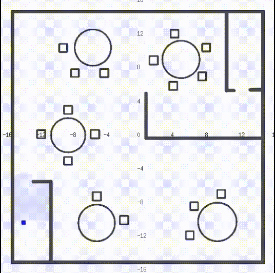

# GestureCommand: A Camera-Based Gesture Recognition System for Autonomous Table-Specific Delivery Robotics

`Gesture-Localisaton-Robot` is a package of camera based hand gesture robot control system. This is a official repository of Final assignment of Intelligent Robotics Module at University of Birmingham. <br />

|       Robot going Table 5        | Ordering robot to Table 5 using mediapipe |
|:--------------------------------:|:-----------------------------------------:|
|  |                 |

## Installation

Git clone this repo to your `<catkin_ws>/src` <br />
**NOTE**: *We assume catkin environment is set up already. Run `catkin_make` after all the installation.*

### Ideal Working Environment

- Ubuntu 20.04
- [ROS Noetic](http://wiki.ros.org/noetic/Installation/Ubuntu)
(desktop-full)
- Python 3.8

### Install dependencies

Before install everything, run the upgrade command so your system stays update to date.
```
sudo apt upgrade && sudo apt update
```
- `sudo apt install ros-$ROS_DISTRO-pr2-teleop ros-$ROS_DISTRO-joy ros-$ROS_DISTRO-slam-gmapping ros-$ROS_DISTRO-map-server`.

This package mainly relies on two libraries: [Mediapipe Machine
Learning library](https://github.com/google/mediapipe) developed by Google and [OpenCV](https://github.com/opencv/opencv) Open
source Computer Vision library (for real time hand detection). <br />
- `pip install mediapipe`
- `pip install opencv-python`

## Testing Simulation and Installation

If everything installed correctly, the following steps should provide
our simulation of a robot in a cafe map.

1. `cd ~/catkin_ws`
2. Run `roslaunch Gesture-Localisation-Robot map_only_v2.launch`
This should start Stage Ros and Rviz with our cafe map.
3. Click the *2D Pose Estimate* button, then draw an arrow on the map showing the
approximate location and direction in which your robot is facing in Stage. 
4. In another terminal, run `rosrun Gesture-Localisation-Robot hand_track_control.py`. Camera will show up. Make sure camera are accessible.

This will allow you to input hand gesture from 0 to 5. 0 is corresponding the Till, and 1 to 5 to Tables respectfully. Hold you hand still about 3 seconds, and the robot should start heading to the ordered table number.

## Contributor

Chit Lee ([Github](https://github.com/chit-uob))<br />
Juni Katsu ([Github](https://github.com/JuniJoo))<br />
Cheuk Yu Lam ([Github](https://github.com/winter7eaf))<br />
Abbas Mandasorwala ([Github](https://github.com/abbas-119)) <br />
Kozerenko Elizaveta ([Github](https://github.com/IBMr))<br />

[//]: # (## Alternative testing with Move_base library)

[//]: # ()
[//]: # (This is testing with Path_finding library `move_base`)

[//]: # (Joint recog.:<br />)

[//]: # ()
[//]: # ()
[//]: # (https://developers.google.com/mediapipe/solutions/vision/gesture_recognizer/python#live-stream)

[//]: # ()
[//]: # (IMPORTANT IMPORTS:<br />)

[//]: # (import cv2 <br />)

[//]: # (import tensorflow as tf  # or import torch)

[//]: # ()
[//]: # (https://github.com/ahmetgunduz/Real-time-GesRec)

[//]: # (https://github.com/MahmudulAlam/Unified-Gesture-and-Fingertip-Detection)

[//]: # (https://github.com/ErickWendel/live-recognizing-multiple-gestures-tensorflowjs <br />)

[//]: # ()
[//]: # ()
[//]: # (https://github.com/kinivi/hand-gesture-recognition-mediapipe)

[//]: # ()
[//]: # (### Nav Stack with Stage. )

[//]: # (Git clone the following link to your `<catkin_ws>/src` <br />)

[//]: # (https://github.com/ros-planning/navigation_tutorial  <br />)

[//]: # (Then run the following. Use 2D goal arrow to set the goal.)

[//]: # (```commandline)

[//]: # (roscore)

[//]: # ()
[//]: # (//change in to new terminal)

[//]: # ()
[//]: # (roslaunch navigation_stage move_base_amcl_2.5cm.launch)

[//]: # (```)

[//]: # (Change the last part respectively )

[//]: # ()
[//]: # (Install:)

[//]: # (mediapipe)

[//]: # (opencv)
